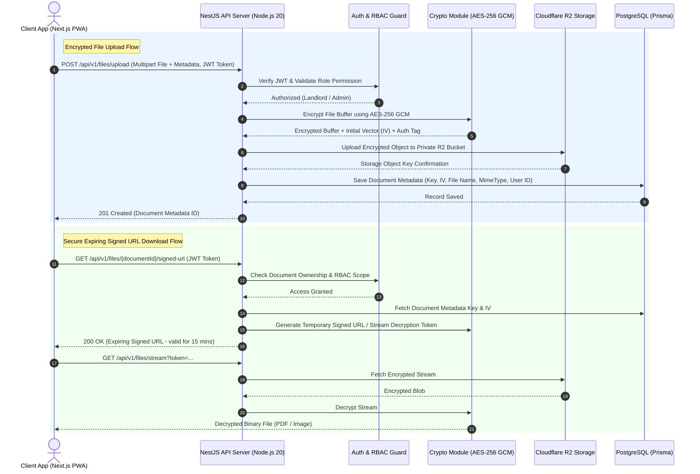

# 🏗️ SYSTEM ARCHITECTURE SPECIFICATION
## System: My Room Ledger (Security-First Decoupled PWA Architecture)

---

## 1. High-Level Architecture Pattern
The system is built using a **Decoupled Security-First Monolith** pattern:
* **Frontend Tier**: **Next.js (TypeScript)** Progressive Web App (PWA) with **Tailwind CSS**, **ShadCN UI**, and **Recharts**, using `next-pwa` for service worker caching, offline capability, and installable app-like UX across Desktop, Tablet, and Mobile devices. Hosted on **Vercel**.
* **Backend Tier**: **Node.js (TypeScript)** with **NestJS 10** (Module → Controller → Service → Prisma Repository Data Access Layer → PostgreSQL), enforcing structured architecture, built-in Guards for RBAC, Interceptors for request/response transformation, and Pipes for Zod validation. Hosted on **Render** / **Railway**.
* **Database Tier**: **PostgreSQL** hosted on **Neon** / **Supabase**, accessed strictly via **Prisma ORM** for type-safe queries, schema migrations, and index optimization.
* **Encrypted Object Storage**: **Cloudflare R2** private bucket storing encrypted Government IDs, payment receipts, and supplier bills. Files are encrypted at backend level via AES-256 GCM before upload and accessed strictly via short-lived backend-generated signed URLs.

```
+---------------------------------------------------------------------------------+
|                        PRESENTATION LAYER (Next.js PWA)                         |
|   +---------------------+   +---------------------+   +---------------------+   |
|   | Super Admin Portal  |   |    Admin Portal     |   | Landlord Dashboard  |   |
|   +----------+----------+   +----------+----------+   +----------+----------+   |
|              |                         |                         |              |
|              +-------------------------+-------------------------+              |
|                                        |                                        |
|                                        v (Tenant Mobile/Desktop PWA)            |
|                             +--------------------------+                        |
|                             |    Tenant Portal UI      |                        |
|                             +------------+-------------+                        |
+------------------------------------------|--------------------------------------+
                                           |
                                           v HTTPS / JSON (REST APIs + JWT)
+---------------------------------------------------------------------------------+
|                        NODE.JS / NESTJS (TypeScript API)                        |
|                                                                                 |
|   +-------------------------------------------------------------------------+   |
|   | Helmet.js (Security Headers) + CORS Lockdown + Throttler (Rate Limit)   |   |
|   +------------------------------------+------------------------------------+   |
|                                        v                                        |
|   +-------------------------------------------------------------------------+   |
|   | JWT Auth Guard → Role Guard (SUPER_ADMIN | ADMIN | LANDLORD | TENANT)   |   |
|   +------------------------------------+------------------------------------+   |
|                                        v                                        |
|   +-------------------------------------------------------------------------+   |
|   | ZodValidationPipe — EVERY body / query / param validated before logic   |   |
|   | HTTP 400 VALIDATION_ERROR on any schema mismatch (no bypass possible)   |   |
|   +------------------------------------+------------------------------------+   |
|                                        v                                        |
|   +-------------------------------------------------------------------------+   |
|   |                   MODULE CONTROLLERS & SERVICE LAYER                    |   |
|   | AuthService | AdminService | RevenueService | BillingService | FileService  |   |
|   +------------------+------------------------------------+-----------------+   |
|                      |                                    |                     |
|  Prisma Data Access  |                                    | AES-256 Encrypted   |
|  (TLS Encrypted)     |                                    | Blob Stream         |
|                      v                                    v                     |
|   +------------------------------------+   +--------------------------------+   |
|   |    DATABASE TIER (PostgreSQL)      |   | CLOUDFLARE R2 ENCRYPTED VAULT  |   |
|   | Users | Buildings | Ledgers | Logs |   | (Private Bucket + Signed URLs) |   |
|   +------------------------------------+   +--------------------------------+   |
+---------------------------------------------------------------------------------+
```

---

## 1b. Request Lifecycle & Validation Enforcement

Every inbound HTTP request passes through the following **mandatory, ordered pipeline** before any business logic is executed:

```
Incoming HTTP Request
        ↓
[1] Helmet.js         — Injects security headers (CSP, HSTS, X-Frame-Options, etc.)
        ↓
[2] CORS Guard        — Rejects all origins not matching NEXT_PUBLIC_FRONTEND_URL
        ↓
[3] Throttler         — Rate limit: 100 req/15min (auth: 5 req/15min) per IP
        ↓
[4] JWT Auth Guard    — Verifies access token signature & expiry. Rejects: 401 UNAUTHORIZED
        ↓
[5] Roles Guard       — Validates JWT role matches @Roles() decorator. Rejects: 403 FORBIDDEN
        ↓
[6] ZodValidationPipe — Validates ALL of: req.body, req.query, req.params
                        against the endpoint's Zod schema.
                        ✅ Pass → typed, sanitized data passed to Controller
                        ❌ Fail → HTTP 400 VALIDATION_ERROR with field-level details
        ↓
[7] Controller        — Receives only clean, validated, typed data. No defensive checks needed.
        ↓
[8] Service           — Pure business logic. No validation. No HTTP concerns.
        ↓
[9] Prisma ORM        — Type-safe parameterized queries. Immune to SQL injection.
        ↓
    HTTP Response
```

> ⚠️ **Strict Rule**: No Controller or Service method may ever receive raw un-validated request data. All input trust is established exclusively at step [6].


---

## 1c. Password Reset & Header Notification Architecture

```
[User: Tenant / Landlord / Admin] 
  └─ Submits Password Reset Request (POST /api/v1/auth/forgot-password-request)
            │
            ▼
[NestJS Backend API]
  ├─ 1. Creates `PasswordResetRequest` (Status: PENDING)
  └─ 2. Emits Notification Event to Admin Header Queue
            │
            ▼
[Admin/Super Admin Frontend App (Next.js)]
  └─ Header Notification Panel (Bell Icon) displays real-time pending reset badge
            │
            ▼
[Admin / Super Admin Action]
  └─ Clicks Notification & Approves Request (POST /api/v1/admin/password-reset-requests/{id}/approve)
            │
            ▼
[NestJS Backend Execution]
  ├─ ROUTE A (User Has Email):
  │    ├─ Generates Signed Reset Link Token (15-min TTL)
  │    ├─ Emails Link to User
  │    ├─ User clicks link → FE `/reset-password?token=...` (displays Name & Email)
  │    └─ User enters New Password + Confirm → Token invalidated, ALL sessions purged, redirect to Login
  │
  └─ ROUTE B (No Registered Email — Fallback Flow):
       ├─ Generates Secure Temporary Password (30-min TTL) & sets `mustChangePassword = true`
       ├─ Displays Temp Password in Admin Single-View Modal (recorded in audit logs)
       ├─ User logs in with Temp Password → forced to "Create New Password" page (displays Name & Email)
       └─ User sets New Password + Confirm → `mustChangePassword` = false, ALL sessions purged, redirect to Login
```

---

## 2. Directory & Module Package Layout

```
my_room_ledger/
├── backend/                        # Node.js TypeScript API (NestJS 10)
│   ├── src/
│   │   ├── config/                 # Environment, JWT, Cloudflare R2 S3 Client config
│   │   │   ├── env.config.ts
│   │   │   ├── prisma.config.ts
│   │   │   └── r2.config.ts
│   │   ├── common/                 # Guards, Interceptors, Pipes, Filters (NestJS-native RBAC)
│   │   │   ├── jwt-auth.guard.ts
│   │   │   ├── roles.guard.ts
│   │   │   ├── zod-validation.pipe.ts
│   │   │   └── http-exception.filter.ts
│   │   ├── modules/                # Feature Modules
│   │   │   ├── auth/               # Login, Refresh, Password Hashing (bcrypt)
│   │   │   ├── admin/              # Super Admin & Admin management
│   │   │   ├── building/           # Buildings, Floors, Rooms, Shared Amenities
│   │   │   ├── tenant/             # Tenant onboarding, KYC metadata, Tenancy History
│   │   │   ├── billing/            # Rent Cycles, Independent Rent & Submeter Elec Ledgers
│   │   │   ├── expense/            # Building Operating Expenses logging
│   │   │   ├── supplier/           # Power Supplier (UPCL) Master Bills & PDF uploads
│   │   │   ├── revenue/            # Multi-level aggregation & predictive analytics
│   │   │   ├── file/               # AES-256 Encryption, Cloudflare R2 Upload, Signed URLs
│   │   │   └── complaint/          # Ticket creation & resolution workflow
│   │   ├── utils/                  # Encryption helpers, Logger, Date formatting
│   │   │   ├── crypto.util.ts      # AES-256 GCM encrypt / decrypt stream
│   │   │   └── signedUrl.util.ts   # R2 S3 signed URL generator
│   │   ├── app.module.ts           # NestJS Root Module registration
│   │   └── main.ts                 # Bootstrap: Helmet, CORS, ZodValidationPipe, Pino logger
│   ├── prisma/
│   │   ├── schema.prisma           # Complete Prisma Database Schema
│   │   └── migrations/             # Versioned SQL migrations
│   ├── Dockerfile                  # Multi-stage production container
│   └── package.json
│
├── frontend/                       # Next.js TypeScript PWA (Vercel)
│   ├── public/
│   │   ├── manifest.json           # PWA manifest
│   │   └── icons/                  # PWA app icons
│   ├── src/
│   │   ├── app/                    # Next.js App Router (Pages & Routes)
│   │   │   ├── (auth)/login/
│   │   │   ├── super-admin/
│   │   │   ├── admin/
│   │   │   ├── landlord/
│   │   │   └── tenant/
│   │   ├── components/             # UI Components (ShadCN UI + Recharts)
│   │   │   ├── ui/                 # Buttons, Dialogs, Cards, Tables, Inputs
│   │   │   ├── dashboard/          # Revenue charts, P&L graphs, Occupancy cards
│   │   │   └── forms/              # Onboarding, Billing, Submeter entry forms
│   │   ├── lib/                    # API Client, Auth storage, Utilities
│   │   │   ├── api.client.ts
│   │   │   └── auth.store.ts
│   │   └── styles/
│   │       └── globals.css         # Tailwind CSS imports
│   ├── next.config.js              # next-pwa plugin configuration
│   └── package.json
│
├── docs/                           # Stage-Wise Engineering Documentation
└── MASTER.md                       # Master Product Specification
```

---

## 3. Security Architecture & File Access Flow



---

## 4. Multi-Level Financial Aggregation Flow

```
                     +---------------------------------------------------+
                     | Level 4: Super Admin Platform                     |
                     | Global Platform Revenue & Metrics                 |
                     +-------------------------+-------------------------+
                                               |
                                               v
                     +---------------------------------------------------+
                     | Level 3: Admin Per-Landlord View                  |
                     | Landlord Financial & Electricity Audit Breakdown  |
                     +-------------------------+-------------------------+
                                               |
                                               v
                     +---------------------------------------------------+
                     | Level 2: Landlord Portfolio View                  |
                     | Rollup across All Owned Buildings                 |
                     | Portfolio Net Profit & Portfolio Elec Variance    |
                     +-------------------------+-------------------------+
                                               |
                                               v
                     +---------------------------------------------------+
                     | Level 1: Single Building P&L & Reconciliation    |
                     | Net Profit = Rent - Expenses                      |
                     | Electricity Variance = Tenant Elec - Master Bill  |
                     | Status: SURPLUS (>0) | DEFICIT (<0) | BALANCED (=0) |
                     +---------------------------------------------------+
```

---

## 5. Electricity Pass-Through & Reconciliation Pipeline

```
   [ROOM SUBMETERS]                                [POWER SUPPLIER (e.g. UPCL)]
   Tenant 1: Units × Rate → Elec Ledger 1           Master Building Bill (Period P)
   Tenant 2: Units × Rate → Elec Ledger 2                    |
   ...                                                       v
   Tenant N: Units × Rate → Elec Ledger N         SupplierMasterBill (Amount = B)
            |                                                |
            +-----------------------+------------------------+
                                    |
                                    v
                    [RECONCILIATION ENGINE (Service Layer)]
                    Total Tenant Elec Collected (C) = SUM(Elec Ledger PAID)
                    Supplier Master Bill Amount (B)
                                    |
                                    v
             Calculates Variance V = C - B (Monthly / IFY / Cycle)
                                    |
         +--------------------------+--------------------------+
         |                                                     |
         v                                                     v
   IF V > 0: SURPLUS                                     IF V < 0: DEFICIT
   (Over-collected extra funds)                          (Under-collected; Out-of-pocket loss)
```

