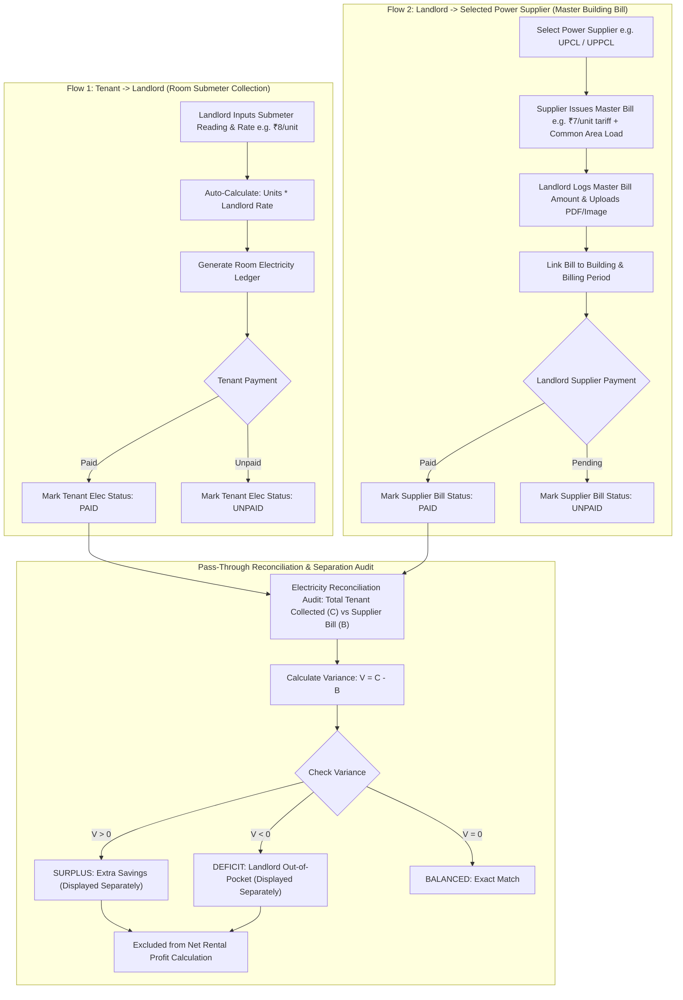

# Stage 01 — Requirement Analysis

**Project:** Room & Rent Ledger Management System (*My Room Ledger*)  
**Status:** In Review (Updated with Electricity Pass-Through Model & Dual Flow Tracking)  
**Date:** 2026-07-27  
**Traceability Reference:** `MASTER.md` $\rightarrow$ `docs/00-engineering-workflow.md`

---

## 1. Executive Problem Statement & Vision

Traditional rental management for urban shared accommodations (PGs, co-living buildings, flat shares) suffers from fragmented tracking of room rent versus utility bills, rigid monthly calendar cycles, lack of historical tenant tracking when room occupants rotate, absence of property-level operating expense logging, and improper treatment of electricity bills as revenue rather than pass-through costs.

**My Room Ledger** solves these challenges by providing a centralized platform featuring:
1. **Multi-Building Asset Hierarchy**: Seamless scaling across $N$ buildings, floors, rooms, and shared/private amenities.
2. **Independent Financial Ledgers**: Strict uncoupling of Room Rent and Electricity Bills with separate payment statuses (`UNPAID`, `PARTIALLY_PAID`, `PAID`, `OVERDUE`).
3. **[NEW REQUIREMENT ADDITION] Electricity Pass-Through Cost Model**:
   - Electricity charges are **non-revenue pass-through costs** paid to external power suppliers (e.g., UPCL).
   - **Landlord Profit Formula**:
     $$\text{Net Profit} = (\text{Room Rent Collected}) - (\text{Building Operating Expenses})$$
     *(Electricity collections are tracked in a dedicated pass-through ledger and excluded from net profit calculations).*
4. **Immutable Tenancy Snapshots**: Locking tenant responsibility records per billing cycle to prevent historical mutation upon move-outs.
5. **4-Tier Strict Access Governance**: Granular RBAC isolating platform administration (`SUPER_ADMIN`, `ADMIN`), landlord control (`LANDLORD`), and tenant transparency (`TENANT`).
6. **Multi-Level Financial Aggregation & Predictive Analytics**: Hierarchical revenue & expense tracking (Single Building $\rightarrow$ Landlord Portfolio $\rightarrow$ Per-Landlord Admin View $\rightarrow$ Platform System-Wide View) combined with time-series trend forecasting and risk detection.

---

## 2. In-Scope vs. Out-of-Scope Boundaries

### 2.1 In-Scope Capabilities
- **Multi-Building & Infrastructure**: CRUD operations for buildings, floors, rooms, shared bathrooms (`Bath XY`), and shared toilets (`Toilet XY`).
- **Power Supply Companies Registry**:
  - Pre-seeded DB table (`power_supply_companies`) hosting initial utility providers: UPCL, UPPCL, Reliance Power Ltd, Adani Power Ltd, TPCL, NTPC.
  - Dropdown API for FE building registration; Admin/Super Admin management (Create, Edit Name, Status Toggle); deletion blocked if linked to $\ge 1$ building.
  - Mandatory selection of a Power Supply Company for each building.
- **Flexible Room Layouts**: Private attached facilities, floor-level shared facilities, and hybrid mixed floors.
- **Tenant Management & History**: Multi-tenant room assignment, KYC record keeping, move-in/move-out audit logs, active vs inactive (vacated) tenant status tracking.
- **Dynamic Rent Cycle Engine**: Mid-tenancy adjustable cycle start days with historical cycle logging.
- **Independent Billing Engine & Dual Electricity Flows**:
  - **Flow 1: Tenant $\rightarrow$ Landlord (Room Submeter Collection)**:
    - Submeter data capture per room: `Units Consumed`, `Start Date`, `End Date`, Landlord `Rate per Unit (₹)` (e.g. ₹8/unit).
    - Auto-calculated formula: $\text{Total Electricity Bill} = \text{Units Consumed} \times \text{Rate per Unit}$.
    - Status tracking: `UNPAID`, `PARTIALLY_PAID`, `PAID`, `OVERDUE`.
  - **Flow 2: Landlord $\rightarrow$ Power Supplier (Master Building Bill)**:
    - Master bill capture per building linked to selected Power Supply Company (e.g. UPCL @ ₹7/unit tariff rate): Master Bill Amount, Due Date, Payment Status (`UNPAID`, `PAID`), Paid Timestamp.
    - **Digital Bill Storage**: File upload for digital supplier bill (Image / PDF) linked to Building and Billing Cycle.
- **Common Electricity Load & Building Expense Tracking**:
  - Accounting for common building electricity consumption (hallway lighting, common sanitation lights, submersible water motor pumps).
  - Paid from electricity surplus or landlord rental income (logged under `WATER_MOTOR_ELECTRICITY` / `COMMON_ELECTRICITY` operating expenses).
  - Landlord capability to log building-level operating expenses (Water bills, maintenance/repairs, cleaning, security, property taxes, miscellaneous).
- **Multi-Level Financial Aggregation Engine**:
  - **Landlord Profit Invariant**: $\text{Net Profit} = (\text{Rent Collected}) - (\text{Building Operating Expenses})$.
  - **Electricity Reconciliation Audit (3 Scenarios)**:
    - $\text{Pass-Through Variance} = (\text{Tenant Electricity Collected}) - (\text{Supplier Master Bill Paid})$.
    - **Surplus Case**: Tenant Collection > Supplier Bill (Extra Savings, displayed separately from Net Profit).
    - **Deficit Case**: Tenant Collection < Supplier Bill (Landlord out-of-pocket contribution, displayed separately from Net Profit).
    - **Break-Even Case**: Tenant Collection = Supplier Bill.
  - **Landlord Views**: Single Building View, All Owned Buildings View across Monthly, IFY Yearly (April 1 – March 31), and Custom Date Ranges.
  - **Admin & Super Admin Views**: System-Wide Platform View, Per-Landlord Aggregated View, Per-Building Scoped View.
- **Historical & Predictive Insights Engine**:
  - **Historical Trends**: Multi-year revenue trends, expense patterns, P&L over time, tenant occupancy history.
  - **Predictive Projections**: Statistical future revenue forecasting based on active tenancies and collection velocity.
  - **Risk Indicators**: Early warnings for mounting unpaid bills, declining occupancy trends, overdue payment spikes, and growing electricity deficits.
- **Tenant Complaints**: Issue reporting, priority tagging, landlord resolution workflow.

### 2.2 Out-of-Scope (Deferred to Future Phases)
- Automated Payment Gateway Integration (Razorpay/Stripe automated checkout).
- Automated SMS/WhatsApp OTP gateways.
- IoT Smart Meters (submeter readings are entered manually by Landlord).

---

## 3. Role Hierarchy & Access Control Matrix

### 3.1 Role Permission Matrix

| Capability / Action | Super Admin | Admin | Landlord | Tenant |
| :--- | :---: | :---: | :---: | :---: |
| Create, Update, Delete Admin & Super Admin Accounts | ✅ Full | ❌ Blocked | ❌ Blocked | ❌ Blocked |
| Onboard & Manage Landlord Profiles | ✅ Full | ✅ Allowed | ❌ Blocked | ❌ Blocked |
| Manage Power Supply Companies (Create/Edit/Status) | ✅ Full | ✅ Allowed | ❌ Blocked | ❌ Blocked |
| System Configuration & Global Audit Logs | ✅ Full | ❌ Read-Only | ❌ Blocked | ❌ Blocked |
| Building & Room Structural Management | 🔍 System Audit | 🔍 System Audit | ✅ Own Properties Only | ❌ Blocked |
| Input Room Submeter Readings & Generate Elec Bill | 🔍 System Audit | 🔍 System Audit | ✅ Own Properties Only | ❌ Blocked |
| Log Master Supplier Bill & Upload PDF/Image | 🔍 System Audit | 🔍 System Audit | ✅ Own Properties Only | ❌ Blocked |
| View Yearly IFY Revenue & P&L Dashboard | 🔍 System Audit | 🔍 System Audit | ✅ Own Properties Only | 🚫 STRICTLY BLOCKED |
| Multi-Level Financial & Electricity Flow View | ✅ System-Wide | ✅ System-Wide | ✅ Own Portfolio | 🚫 STRICTLY BLOCKED |
| View Room Payment History (Rent + Submeter Elec) | 🔍 System Audit | 🔍 System Audit | ✅ Own Properties Only | 🔍 Own Assigned Room Only |
| Create / Track Complaints | 🔍 Audit | 🔍 Audit | 🔍 Audit / Resolve | ✅ Log & Track Own |

### 3.2 Security & Data Isolation Enforcement Rules
1. **Backend Source of Truth**: Authorization is enforced via NestJS `@Roles(...)` decorators, `JwtAuthGuard`, and `RolesGuard`. The frontend renders menus/controls dynamically for UX, but client-side gating is not relied upon for security.
2. **Landlord Data Isolation**: Database queries enforce row-level ownership checks (`where: { landlordId: req.user.id }`). Landlord A cannot query Landlord B's buildings, tenants, or financial ledgers under any condition.
3. **Tenant Self-Access Isolation**: Tenant access is strictly scoped to `where: { tenantId: req.user.tenantId }`. Tenants have zero visibility into other rooms, other tenants, building operating expenses, or revenue dashboards.
4. **Super Admin Creation Protection**: Only an existing `SUPER_ADMIN` can create another `SUPER_ADMIN`. Attempting to register or promote a Super Admin from an Admin account returns `HTTP 403 FORBIDDEN`.

---

## 4. Electricity Pass-Through Workflow & Architecture

### 4.1 Dual-Flow Architecture Diagram

---

## 5. Detailed Edge Cases & Handling Strategies

| Edge Case ID | Scenario Description | Impact | System Handling Strategy |
| :--- | :--- | :--- | :--- |
| **EC-ELE-01** | **Master Supplier Bill vs Submeter Sum Mismatch** | Total of room submeter bills does not match the master building bill (e.g. common area electricity consumption). | System maintains submeter collections separate from master supplier bill. Common area variance is logged under Building Expenses (Maintenance) rather than distorting tenant submeter ledgers. |
| **EC-ELE-02** | **Tenant Vacates Mid-Cycle** | Tenant checks out before the end of an electricity billing cycle. | Landlord takes a final submeter reading on checkout day. System generates a pro-rated interim electricity ledger for that tenant linked to their tenancy snapshot. |
| **EC-ELE-03** | **Power Supplier Bill Delayed** | Supplier issues master bill late after tenant room bills are generated. | Submeter room ledgers are generated independently on schedule. Master supplier bill is attached asynchronously when received without blocking tenant collections. |
| **EC-ELE-04** | **Partial Tenant Payment for Electricity** | Tenant pays Room Rent in full but pays only part of Electricity Bill. | Rent status transitions to `PAID`, while Electricity status transitions to `PARTIALLY_PAID` with recorded `amount_paid` and remaining balance carried forward. |
| **EC-ELE-05** | **Digital Bill Upload Verification** | File corruption or invalid file upload for supplier bill receipt. | System enforces file extension validation (`.pdf`, `.jpg`, `.png`), size limit (max 10MB), and stores file path in isolated blob/S3 storage. |

## 6. Security-First Architecture & Cloud Tech Stack Specifications

To satisfy all performance, responsiveness, and security-first mandates, the system architecture locks in the following technological foundation:

1. **[NEW REQUIREMENT ADDITION] Installable Mobile-First Progressive Web App (PWA)**:
   - **Framework**: Next.js (TypeScript) + `next-pwa` (Service workers, offline fallback, caching strategy).
   - **Styling & UI**: Tailwind CSS + ShadCN UI components for accessible, app-like responsive UI across Desktop, Tablet, and Mobile.
   - **Data Visualization**: Recharts for interactive financial P&L and occupancy analytics.
   - **Deployment Target**: Vercel.

2. **[NEW REQUIREMENT ADDITION] Scalable Node.js Backend API**:
   - **Runtime & Language**: Node.js 18+ (TypeScript).
   - **Framework**: NestJS 10 (TypeScript) — modular architecture with built-in Guards (RBAC), Interceptors, Pipes (Zod validation), and Filters (error handling).
   - **Input Validation (STRICT MANDATE)**: **Every API endpoint input** (request body, query params, route params) MUST pass through a **Zod schema** via `ZodValidationPipe` before reaching any Controller or Service. Joi is **not used** — Zod is the exclusive validation library.
   - **Validation Failure**: Returns `HTTP 400 VALIDATION_ERROR` with structured field-level error details.
   - **Security Middleware Stack** (applied globally in order): Helmet.js → CORS lockdown → `@nestjs/throttler` rate limiting → JWT Auth Guard → Roles Guard → ZodValidationPipe.
   - **Authentication**: JWT stateless authentication — access tokens (10-min TTL, in-memory) + refresh tokens (7-day TTL, `HttpOnly` cookie) with **Argon2id password hashing** (64MB RAM, 3 iterations, 4 parallelism). All token lifecycles governed by [`docs/ttl-registry.md`](ttl-registry.md). All primary keys use **UUIDv7** time-ordered identifiers.
   - **Deployment Target**: Render / Railway.

3. **[NEW REQUIREMENT ADDITION] PostgreSQL with Prisma ORM**:
   - **Database**: PostgreSQL 15+ hosted on Neon / Supabase.
   - **ORM**: Prisma ORM for type-safe database queries, schema migrations, and declarative relation definitions.
   - **Data Separation**: Stores user profiles, billing ledgers, building metadata, audit logs, and document **metadata only** (actual files are stored in Cloudflare R2).

4. **[MANDATORY SECURITY REQUIREMENT] Cloudflare R2 Encrypted Object Storage**:
   - **Backend-Side Encryption**: All sensitive files (Government IDs, payment receipts, supplier bills) MUST be encrypted using backend AES-256 GCM BEFORE being written to Cloudflare R2.
   - **Zero Public Access**: Storage buckets are strictly private. Direct public bucket URLs are prohibited.
   - **Expiring Signed URLs**: Client access to files occurs strictly through short-lived backend-generated signed URLs after enforcing role authorization.

---

## 7. Proactive Deployment & Cloud Readiness Requirements

To ensure zero-friction deployment from local development to production:
1. **Containerized Build**: Docker & Docker Compose setup for backend API and local PostgreSQL instance.
2. **Low-Cost Target ($0 – $5 / Month)**: Next.js on Vercel ($0) + Node.js API on Render/Railway ($0-$5) + Neon/Supabase PostgreSQL ($0) + Cloudflare R2 ($0 for 10GB).
3. **Living Deployment Document**: Full deployment strategy details documented in [`docs/deployment-strategy.md`](deployment-strategy.md).

---

## 8. Document Status & Traceability

- **Requirement Analysis Status**: Updated with Next.js PWA, **NestJS (Node.js TypeScript)** backend, Prisma ORM, Cloudflare R2 Encrypted Storage, and Security-First Mandate.
- **Next Stage**: `Stage 02 — Functional Requirements & Acceptance Criteria` (`docs/02-functional-requirements.md` and `docs/acceptance-criteria.md`).
