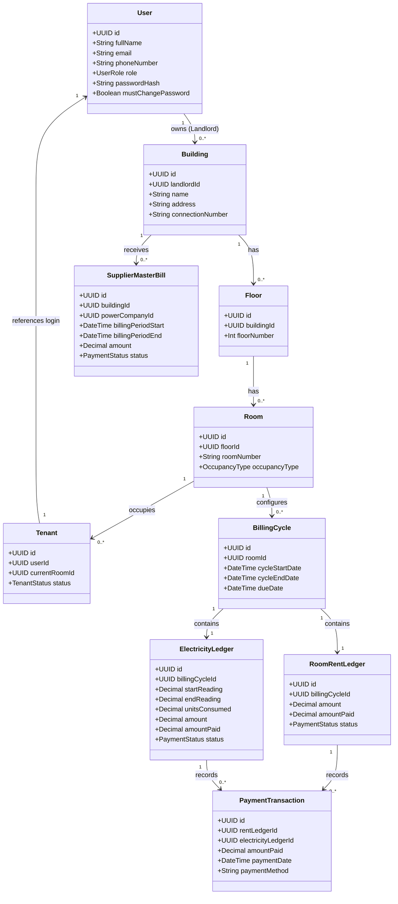
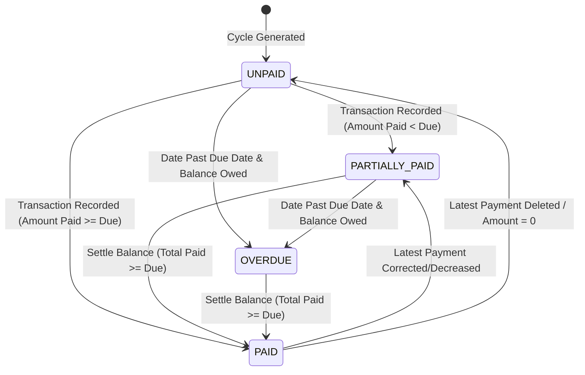
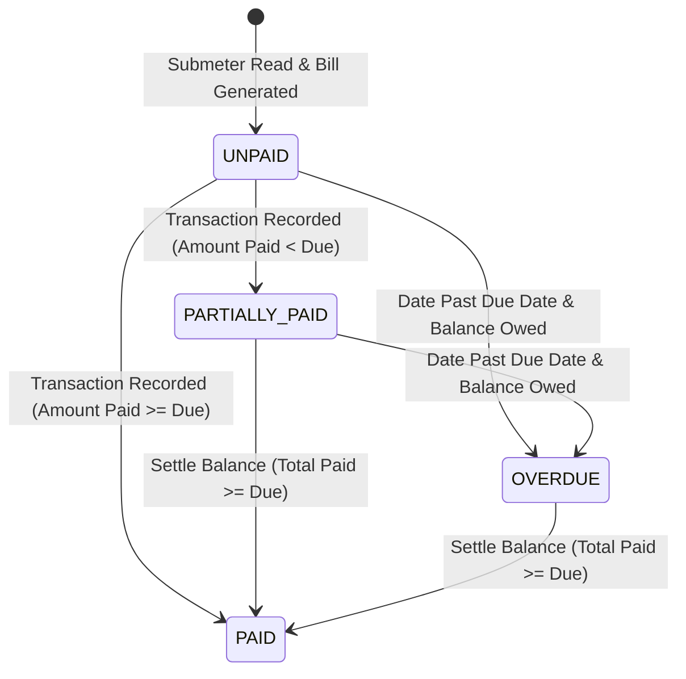
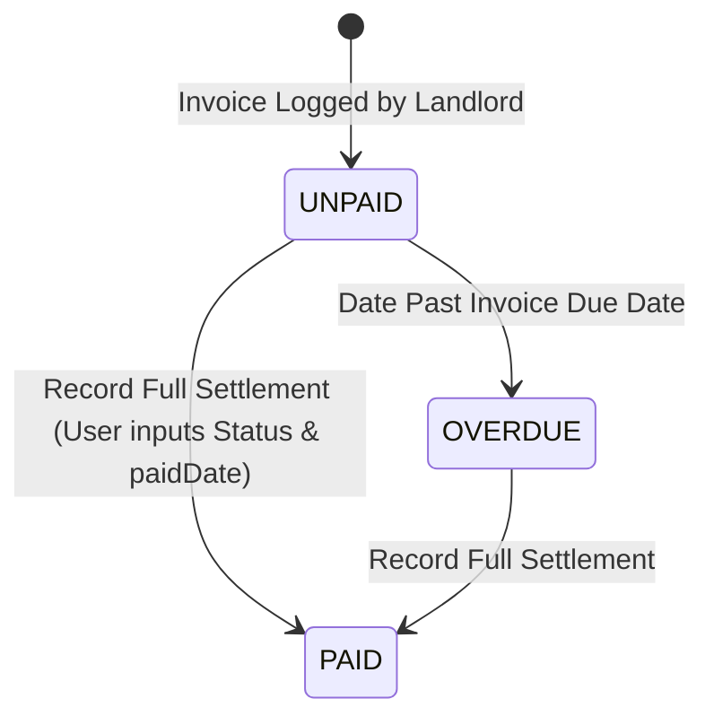
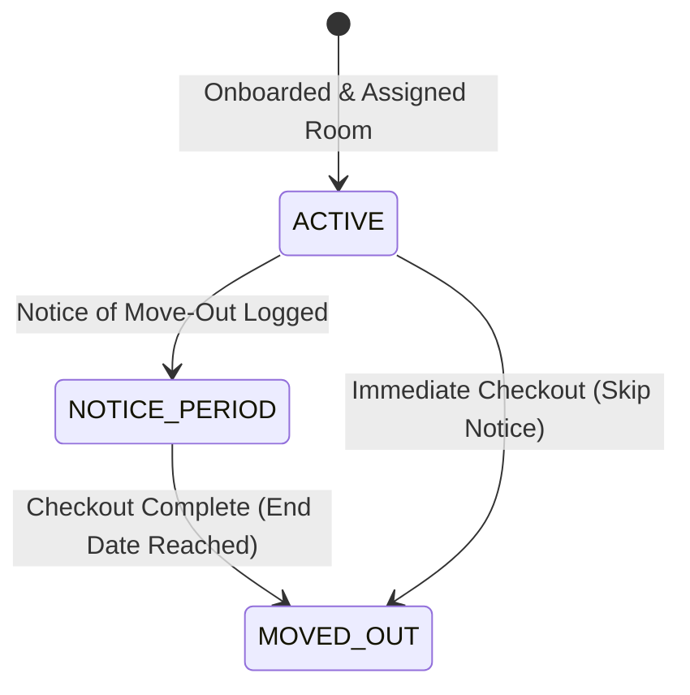
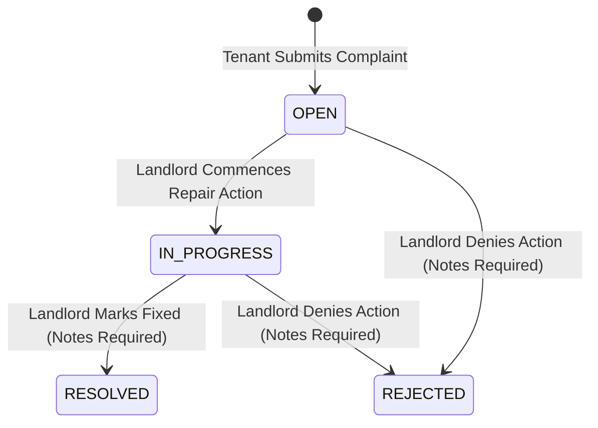
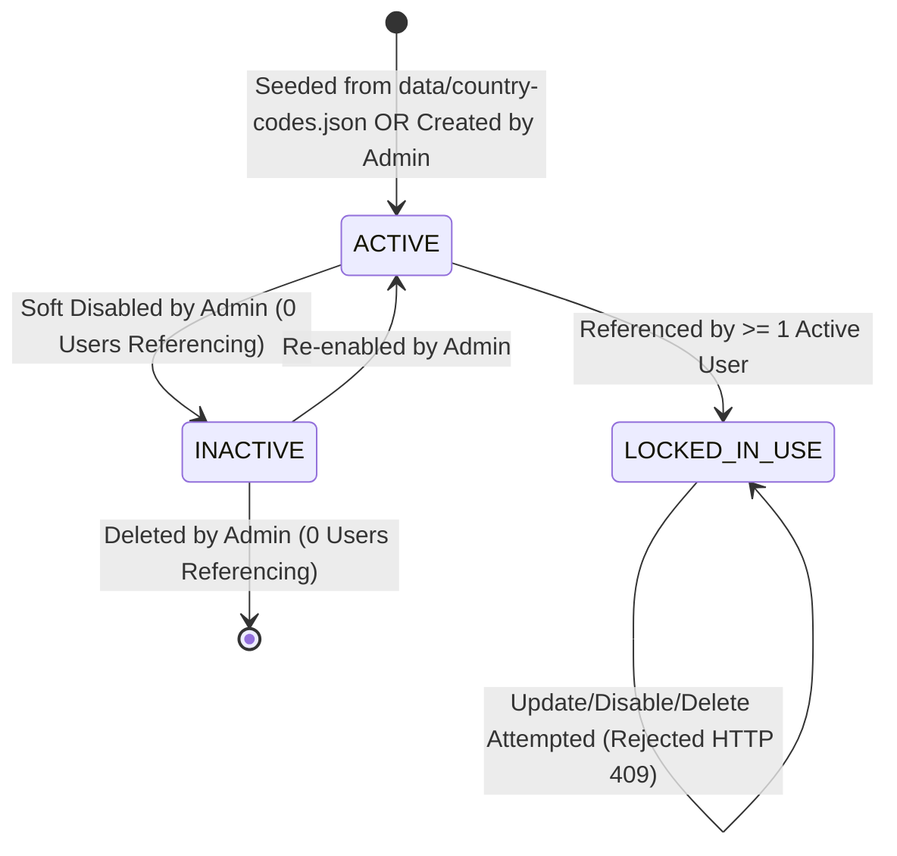
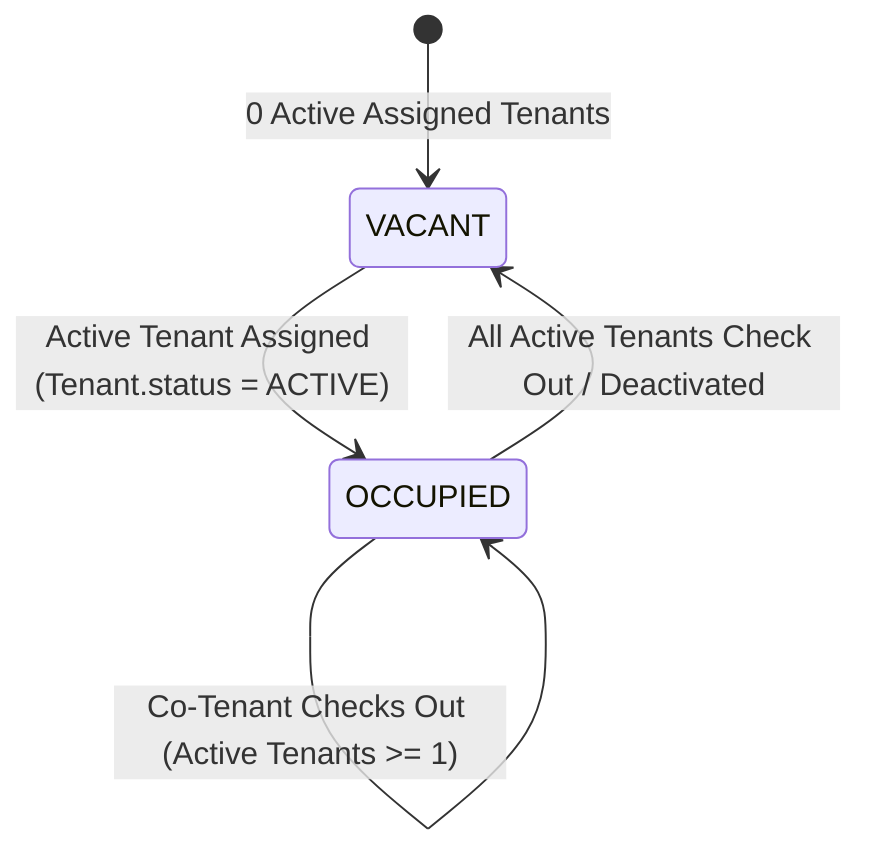
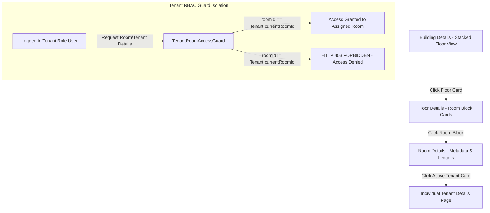

# Stage 04 — Domain Model & State Machines Specification

**Status:** Under Review (Pending User Confirmation) ⏳  
**Upstream:** [03-non-functional-requirements.md](03-non-functional-requirements.md) (Confirmed & Locked ✅)  
**Downstream:** Stage 05 (Database Design)  
**Workflow tracker:** [00-engineering-workflow.md](00-engineering-workflow.md)

---

## 1. Relational ER Diagram & Entity Mapping

The system follows a strict hierarchical layout mapping user entities and physical room infrastructure to financial ledgers and tracking logs.

---

## 2. Complete Entity Registry (24 Models)

All models consistently utilize time-ordered **UUIDv7** primary keys to ensure maximum database insert performance and B-Tree locality (`BR-10.4`, `NFR-11`).

### 2.1 User & Authentication Subsystem
1. **`User`**: Authoritative system-wide credential and profile container (`SUPER_ADMIN`, `ADMIN`, `LANDLORD`, `TENANT`), linked to `CountryCode` via `countryCodeId` with `ON DELETE RESTRICT`.
2. **`PasswordResetRequest`**: Multi-use self-service password recovery tracker. Status defaults to `PENDING` (`BR-11.2`).
3. **`UserSession`**: Persistent session store tracking tokens, IPs, and user agents to enable targeted revocations (`BR-16.5`).
4. **`CountryCode`**: Database-driven registry of valid tenant/landlord phone dial codes, flags, and regex patterns (`BR-12`). Seeded from reusable JSON (`data/country-codes.json`). Managed by Admins, strictly protected by `ON DELETE RESTRICT` and in-use immutability rules.

### 2.2 Asset & Infrastructure Hierarchy
5. **`Building`**: High-level property asset containing floors, expenses, and connections (`BR-05`).
6. **`Floor`**: Floor subdivision grouping rooms and shared facilities (`BR-06`).
7. **`Room`**: Individual tenant room with specific occupancy types and attached properties (`BR-07`).
8. **`SharedBathroom`**: Shared floor utility linked to a Floor (`BR-06`).
9. **`SharedToilet`**: Shared floor toilet facility linked to a Floor (`BR-06`).

### 2.3 Tenant Lifecycle & History
10. **`Tenant`**: User metadata linking to active room tenancies and status (`BR-08`).
11. **`TenancyHistory`**: Immutable log capturing when tenants move in and out of specific rooms (`BR-08`).
12. **`DocumentMetadata`**: Private Cloudflare R2 file uploads storing encrypted IDs and bills (`BR-10.3`).

### 2.4 Ledger & Billing Engine
13. **`RentCycleConfig`**: Template settings governing billing intervals, start days, and standard rents (`BR-02`).
14. **`BillingCycle`**: Master cycle container grouping Rent and Electricity ledgers for a room cycle.
15. **`BillingCycleTenantsSnapshot`**: Immutable snapshot tracking which tenants were in the room when the cycle was generated (`BR-08`).
16. **`RoomRentLedger`**: Financial ledger tracking rent amounts due, collected, and cycles (`BR-03.4`).
17. **`ElectricityLedger`**: Financial ledger tracking tenant submeter units consumed and amount due (`BR-03.4`).
18. **`PaymentTransaction`**: Individual cash collections against room rent or electricity ledgers (`BR-14.1`).

### 2.5 Power Connection & Utility Reconciliation
19. **`PowerSupplyCompany`**: Pre-seeded DB registry of electricity providers (`BR-13.1`).
20. **`BuildingPowerConnection`**: Immutable history audit log tracking power suppliers over time (`BR-13.9`).
21. **`SupplierMasterBill`**: Landlord utility bill issued by the power company (`BR-13.4`, `BR-14.6`).
22. **`BuildingExpense`**: Non-utility operating expenses (e.g. cleaning, taxes) used for P&L calculations (`BR-04.2`).

### 2.6 Operations & Logging
23. **`Complaint`**: Tenant-submitted maintenance and billing tickets (`BR-09`).
24. **`AuditLog`**: Centralized insert-only system activity log (`BR-16.1`).

---

## 3. Financial State Machines & Transition Rules

Ledgers are strictly decoupled (`BR-03.4`). Payments are processed sequentially, and status transitions occur automatically based on payment mathematics.

### 3.1 Room Rent Ledger State Machine
Rent ledgers track the accumulation of landlord collections.

#### Transition Invariants & Guard Rules
* **Initial State:** Always `UNPAID` upon billing cycle generation.
* **Date-Driven Transition:** A scheduler evaluates cycles daily. If `currentDate > BillingCycle.dueDate` and status is `UNPAID` or `PARTIALLY_PAID`, the status transitions to `OVERDUE` (`BR-14.3`).
* **Lump-Sum / Partial Collections:** Every `PaymentTransaction` links to the ledger. On insertion, the system computes $S = \sum(\text{PaymentTransaction.amountPaid})$.
  * If $S \ge \text{RoomRentLedger.amount}$, status $\rightarrow$ `PAID`.
  * If $S > 0$ and $S < \text{RoomRentLedger.amount}$, status $\rightarrow$ `PARTIALLY_PAID`.
  * If $S = 0$, status $\rightarrow$ `UNPAID` (or `OVERDUE` if past due date).
* **Last Transaction Only Guard:** Only the chronologically latest transaction (highest `recordedAt`) can be modified or deleted. Any modification triggers parent status recalculation using the rules above (`BR-14.7`). Edits to older transactions are strictly blocked (`HTTP 409`).

---

### 3.2 Electricity Ledger State Machine
Tracks individual tenant submeter usage payments. Relies on the same payment math triggers as the Room Rent ledger but operates completely independently.

#### Transition Invariants & Guard Rules
* **Initial State:** Always `UNPAID` upon landlord entering the ending submeter reading.
* **Separation Invariant:** A payment made against `ElectricityLedger` has its own `PaymentTransaction` records. It MUST NEVER influence the state of the room's `RoomRentLedger` (`BR-03.4`).
* **Reconciliation Cutoff Rules:** Tenant payments are mapped to the building's master electricity cycle based on the transaction's `paymentDate` timestamp, NOT the ledger billing cycle date (`BR-03.5`).

---

### 3.3 Supplier Master Bill State Machine
Enforces rigid, single-payment settlement with no partial states (`BR-14.6`).

#### Transition Invariants & Guard Rules
* **No Partial Payments:** Master bills paid to power companies must be settled in full. There is no `PARTIALLY_PAID` status.
* **Reconciliation Trigger:** Transitioning a `SupplierMasterBill` to `PAID` triggers the 3-scenario reconciliation engine to aggregate tenant collections within the master bill's date range and compute surplus/deficit variance (`BR-03.3`).
* **Supplier Switch Block:** Attempting to switch building power supplier is blocked (`HTTP 409 PENDING_SUPPLIER_BILLS_EXIST`) if any building master bill is in `UNPAID` or `OVERDUE` state (`BR-13.8`).

---

## 4. Operational Lifecycles & Workflows

### 4.1 Tenancy Lifecycle & Snapshot Protection
Tracks tenant movements while protecting billing integrity.

#### Invariants & Guard Rules
* **Active Status:** Tenant is linked to a room. Billing cycle generator reads `ACTIVE` and `NOTICE_PERIOD` tenants.
* **KYC Immutability:** Onboarding requires uploading valid ID proof (stored securely on Cloudflare R2).
* **Snapshot Generation:** When a room billing cycle is created, the active tenant list is copied into `BillingCycleTenantsSnapshot` (`BR-08`).
* **Historical Isolation:** Even if a tenant transitions to `MOVED_OUT` or is deleted, historical `RoomRentLedger` and `ElectricityLedger` bills remain locked and refer to the snapshot, preventing retroactive modifications.

---

### 4.2 Maintenance & Complaint System Workflow
Allows tenants to raise tickets and landlords to resolve operational issues.

#### Transition Invariants & Guard Rules
* **Creation:** Generated by active tenants. Auto-assigns status to `OPEN` (`BR-09`).
* **Update Roles:** Only Landlords assigned to the building can transition status from `OPEN` $\rightarrow$ `IN_PROGRESS` $\rightarrow$ `RESOLVED` / `REJECTED` (`docs/rbac-matrix.md`).
* **Resolution Notes Mandatory:** Transitioning to `RESOLVED` or `REJECTED` strictly requires the landlord to fill out the `landlordNotes` field. If omitted, the API rejects the transition with `HTTP 400 VALIDATION_ERROR`.
* **Resolution Timestamp:** Transitioning to `RESOLVED` or `REJECTED` automatically timestamps `resolvedAt` to server UTC time.

---

### 4.3 Country Code Operational Lifecycle & In-Use Protection
Governs creation, usage, and protection invariants for international dial code entities (`BR-12.3`, `FR-35`).

#### Transition Invariants & Guard Rules
* **Initial Seeding:** Pre-populated during initial DB setup using `data/country-codes.json` (7 initial countries: India, US, Canada, UK, UAE, Nepal, Sri Lanka). India (`+91`) defaults to `isDefault = true`.
* **In-Use Protection Invariant (`LOCKED_IN_USE`):** Whenever a `CountryCode` entity is linked to $\ge 1$ `User` records:
  - ❌ **Delete Blocked:** Hard deletion (`DELETE`) is rejected at DB (`ON DELETE RESTRICT`) and API layers with `HTTP 409 Conflict` (`COUNTRY_CODE_IN_USE`).
  - ❌ **Disable Blocked:** Setting `isActive = false` is rejected with `HTTP 409 Conflict` (`COUNTRY_CODE_IN_USE`).
  - ❌ **Update Blocked:** Updating dial code, country code, country name, or phone regex pattern is rejected with `HTTP 409 Conflict` (`COUNTRY_CODE_IN_USE`).
* **Unused Record Administration:** Only `CountryCode` records referencing zero (`0`) users can be modified, disabled, or deleted.

---

### 4.4 Building, Floor & Room Occupancy Hierarchy & Navigation Workflow
Governs dynamic active-tenant-based structural occupancy calculation and hierarchical navigation (`BR-17`, `FR-119`–`FR-130`). Detailed in [`docs/building-occupancy.md`](building-occupancy.md) (Occupancy domain rules) and [`docs/frontend-navigation.md`](frontend-navigation.md) (UI presentation & responsive navigation).

#### Navigation Hierarchy & Access Guard Flow

#### Transition Invariants & Guard Rules
* **Active Derivation Rule:** Occupancy status is derived dynamically from currently assigned active tenants (`Tenant.status = ACTIVE`). Historical tenant records (`TenancyHistory`) do NOT keep a room marked as occupied.
* **Structural Aggregation:** A floor is `OCCUPIED` if $\ge 1$ room is occupied; `VACANT` if all rooms are vacant. A building is `OCCUPIED` if $\ge 1$ room across any floor is occupied; `VACANT` if all rooms are vacant.
* **Tenant Isolation Guard:** NestJS `TenantRoomAccessGuard` strictly enforces that `TENANT` users can ONLY access the Room Details page of their assigned room (`Tenant.currentRoomId`). Attempts to access unassigned rooms, floors, or buildings are rejected with `HTTP 403 FORBIDDEN`.

---

## 5. Traceability Map (Domain Entity → Requirement ID)

All domain entities and state machines map back to the requirements and core business rules:

| Domain Component | Associated Entity / State | Source Business Rule | Functional Requirement | Non-Functional Requirement |
|---|---|---|---|---|
| **Access Control** | `User`, `UserSession` | `BR-01`, `BR-16.5` | `FR-01` – `FR-08` | `NFR-01`, `NFR-04` |
| **Country Codes** | `CountryCode` | `BR-12.1` – `BR-12.5` | `FR-01f`, `FR-35a` – `FR-35f` | `NFR-25` |
| **Occupancy & Stack Navigation** | `Building`, `Floor`, `Room`, `Tenant` | `BR-17.1` – `BR-17.5` | `FR-119` – `FR-130` | `NFR-26` |
| **Asset Hierarchy** | `Building`, `Floor`, `Room` | `BR-05`, `BR-06`, `BR-07` | `FR-22` – `FR-28` | `NFR-11` |
| **Tenancy Lifecycle** | `Tenant`, `TenancyHistory` | `BR-08` | `FR-30` – `FR-35` | `NFR-07` |
| **Rent Billing** | `RoomRentLedger` | `BR-03.4`, `BR-14.2` | `FR-36` – `FR-42` | `NFR-08`, `NFR-09` |
| **Submeter Billing** | `ElectricityLedger` | `BR-03.4`, `BR-14.2` | `FR-43` – `FR-49` | `NFR-08`, `NFR-09` |
| **Payments** | `PaymentTransaction` | `BR-14.1`, `BR-14.7` | `FR-97` – `FR-100` | `NFR-06`, `NFR-08` |
| **Power Suppliers** | `PowerSupplyCompany` | `BR-13` | `FR-50` – `FR-54` | `NFR-11` |
| **Master Utility** | `SupplierMasterBill` | `BR-13.8`, `BR-14.6` | `FR-101` – `FR-112` | `NFR-10` |
| **Complaints** | `Complaint` | `BR-09` | `FR-73` – `FR-77` | `NFR-20` |
| **Audit Logs** | `AuditLog` | `BR-16.1` | `FR-93` – `FR-96` | `NFR-06` |
