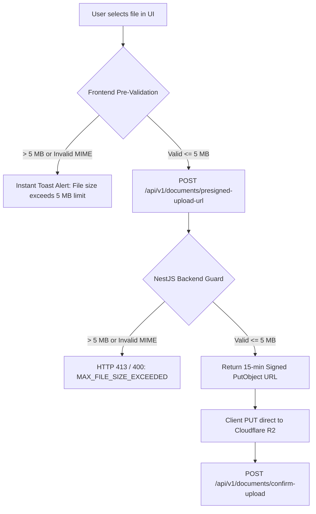

# Global File-Storage, Upload Policy & Security-First Storage Cost-Optimization Specification

**Status:** Active & Locked ✅  
**Upstream:** [docs/governance/business-rules.md](../governance/business-rules.md) (`BR-10`, `BR-18`), [docs/stages/02-functional-requirements.md](../stages/02-functional-requirements.md) (`FR-131`–`FR-136`), [docs/stages/03-non-functional-requirements.md](../stages/03-non-functional-requirements.md) (`NFR-03`, `NFR-27`), [database-schema.md](../technical/database-schema.md)  
**Downstream:** [api-contracts.md](../technical/api-contracts.md), [docs/governance/rbac-matrix.md](../governance/rbac-matrix.md), Stage 05 Database Design, Stage 06 API Design, Stage 07 Frontend Architecture, Stage 13 Implementation  
**Single Source of Truth:** This document is the **sole authoritative reference** for file size limits, MIME type validation, presigned direct-to-R2 upload workflows, storage cost-optimization mechanisms, data retention pipelines, and zero-compromise security governance across the application.

---

## 1. Universal File-Upload Policy & Size Limit

1. **Global Maximum File Size Ceiling**:
   - **Limit**: Strictly **5 MB per file** ($5,242,880\text{ bytes}$).
   - **Scope**: Enforced universally across **ALL** document upload features, including:
     - Electricity Supplier Master Bills & Meter Photo attachments
     - Room Rent & Utility Payment Transaction Receipts
     - Tenant Identity Verification Documents (Aadhaar, Passport, Driving License, Voter ID)
     - Maintenance Complaint Photo attachments & Inspection Records
     - User Profile Avatars / Photos
     - Generated Financial Export Reports (PDF / CSV)
2. **Standard MIME Type Allowlist**:
   Only verified MIME types are accepted for document uploads:
   - Images: `image/jpeg`, `image/png`, `image/webp`
   - Documents: `application/pdf`
   - All other file types (executable `.exe`, script `.js`, archive `.zip`, etc.) are strictly prohibited and rejected by server validation.

---

## 2. Dual-Layer Validation Architecture

To combine optimal user experience with absolute backend security, file validation executes at both client and server layers:



### 2.1 Frontend Pre-Validation (UX Layer)
- Client PWA checks `file.size <= 5242880` bytes and `file.type` against the MIME allowlist prior to initiating network requests.
- If a file exceeds 5 MB, the UI immediately cancels transmission, displays a field-level error below the file input (`"File size exceeds maximum limit of 5 MB (5,242,880 bytes). Please select a smaller file."`), and prevents unnecessary API bandwidth usage.

### 2.2 Backend Authoritative Validation (Security Source of Truth)
- Regardless of frontend checks, the backend is the **sole source of truth**.
- NestJS `PresignedUploadGuard` and `ZodValidationPipe` inspect request metadata (`fileSizeBytes`, `mimeType`).
- **Error Response Standard (`HTTP 413 PAYLOAD_TOO_LARGE` / `HTTP 400 BAD_REQUEST`)**:
  ```json
  {
    "statusCode": 413,
    "error": "MAX_FILE_SIZE_EXCEEDED",
    "message": "File size exceeds maximum allowed limit of 5 MB (5,242,880 bytes). Please upload a smaller file.",
    "field": "fileSizeBytes",
    "maxAllowedBytes": 5242880,
    "timestamp": "2026-08-16T23:30:00Z",
    "path": "/api/v1/documents/presigned-upload-url"
  }
  ```

---

## 3. Presigned Direct-to-R2 Upload Workflow

To protect NestJS API servers from memory exhaustion (OOM), high CPU usage during file stream parsing, and proxy bandwidth costs, all document uploads use Cloudflare R2 Presigned URLs:

1. **Presigned URL Request**:
   Client calls `POST /api/v1/documents/presigned-upload-url` providing `{ fileName, mimeType, fileSizeBytes, category }`.
2. **Backend Validation & Grant**:
   Backend validates user role permissions, enforces the 5 MB ceiling, generates a time-bound (15-minute TTL) AWS S3 SDK Presigned `PutObject` URL targeted at Cloudflare R2 bucket, and registers a `PENDING_UPLOAD` document metadata record.
3. **Direct Transfer**:
   Client executes an HTTP `PUT` request directly to the presigned R2 URL.
4. **Upload Confirmation**:
   Client notifies backend via `POST /api/v1/documents/{id}/confirm-upload`. Backend verifies file existence and object size in R2, calculates SHA-256 hash, and updates status to `ACTIVE`.

---

## 4. Security-First Storage Cost-Optimization Architecture

Storage cost optimization is achieved through 4 complementary technical strategies, strictly governed by zero-compromise security principles:

```math
\text{Total Storage Cost} = \text{ClientCompression}(\text{Bytes}) + \text{Deduplication}(\text{Duplicates}) + \text{R2AutoTiering}(\text{Age}) + \text{PurgePipeline}(\text{SoftDeleted})
```

### 4.1 Strategy 1: Client-Side WebP Image Compression
- **Mechanism**: Before requesting a presigned URL for image uploads (`image/jpeg`, `image/png`), client-side PWA utilities downscale oversized high-resolution photos (e.g. 12 MB camera shots) to a max dimension of 2048px and convert format to lossy WebP (`quality: 0.82`).
- **Storage Impact**: Reduces average image size from ~4.5 MB down to ~350 KB (**~92% storage savings**) prior to upload.
- **Security Constraint**: Compression executes locally on the user's device in memory before upload. Original encrypted document metadata and cryptographic verification remain intact.

### 4.2 Strategy 2: SHA-256 Content-Based Document Deduplication
- **Mechanism**: Upon upload confirmation, NestJS backend calculates the cryptographic SHA-256 hash of the uploaded object. If an identical document (`sha256Hash`) already exists in R2 storage (e.g. identical PDF utility bill uploaded for multiple rooms), the database links the existing `r2ObjectKey` and purges the duplicate upload.
- **Storage Impact**: Eliminates redundant file storage across multi-room or multi-tenant operations.
- **Security Constraint**: Deduplication is scoped strictly by system-wide cryptographic hash matching. Encryption keys and tenant RBAC access permissions are stored independently per entity.

### 4.3 Strategy 3: Cloudflare R2 Lifecycle Auto-Tiering
- **Mechanism**: R2 storage bucket policies automatically transition older inactive objects:
  - **Standard Storage**: 0 – 90 days (Immediate high-speed access for active billing cycles).
  - **Infrequent Access (IA)**: 91 – 365 days (Reduced storage cost per GB).
  - **Glacier Cold Archive**: $> 365$ days (Long-term audit retention compliance).
- **Storage Impact**: Reduces long-term storage unit cost by **~65%** for historical documents while maintaining 100% data availability.
- **Security Constraint**: Objects remain encrypted at rest with **AES-256 GCM** across all storage tiers. Access remains governed exclusively by NestJS 15-minute presigned URLs.

### 4.4 Strategy 4: Automated Soft-Deleted Document Purge Pipeline
- **Mechanism**: When a document, complaint attachment, or tenant record is soft-deleted (`isDeleted = true`), R2 storage objects enter a 30-day grace period. A nightly scheduled Cron job (`DocumentPurgeCron`) permanently deletes objects (`DeleteObject`) from R2 after the 30-day retention window expires.
- **Storage Impact**: Prevents orphan/abandoned files from permanently consuming storage quota.
- **Security Constraint**: All deletion events are logged in the immutable `AuditLog` table (`ACTION: PURGE_DOCUMENT_OBJECT`).

---

## 5. Security Governance & Immutability Matrix

> [!CAUTION]
> **Zero-Compromise Security Principle**: Under no circumstances shall encryption algorithms, URL expiration limits, access control checks, or audit logs be altered, weakened, or bypassed to reduce storage costs.

| Security Control | Technical Standard | Cost Optimization Safeguard |
| :--- | :--- | :--- |
| **Encryption at Rest** | AES-256 GCM (Server-Side Encryption) | Retained 100% across all R2 storage tiers (Standard, IA, Archive). |
| **Access Control** | 15-minute TTL Presigned Download URLs | URLs generated dynamically by NestJS backend after validating JWT & Session. |
| **RBAC Isolation** | NestJS `DocumentAccessGuard` | Tenants can ONLY access documents linked to their assigned room/profile. |
| **Audit Logging** | Immutable `AuditLog` table (`audit_logs`) | Every upload, download, deduplication, and purge event is logged permanently. |
| **Data Integrity** | SHA-256 Cryptographic Digest | Verified on every upload confirmation to detect file corruption or tampering. |

---

## 6. Maintenance Policy for Storage & Upload Requirements

Whenever new document types, storage optimization parameters, or upload rules are introduced in future stages:
1. **Update ONLY this document** (`file-storage-and-upload-policy.md`).
2. Reference this document from `docs/governance/business-rules.md` (`BR-18`), `docs/stages/02-functional-requirements.md`, `docs/stages/03-non-functional-requirements.md`, and `MASTER.md`.
3. **Do NOT duplicate file validation logic or storage formulas** across other documents.
