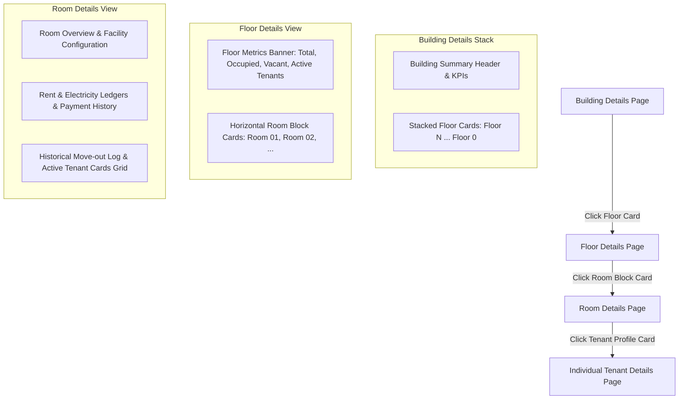

# Frontend Navigation & Responsive UI/UX Specification

**Status:** Active & Locked ✅  
**Upstream:** [building-occupancy.md](building-occupancy.md) (Domain occupancy rules & metrics source of truth), [business-rules.md](business-rules.md) (`BR-17`), [02-functional-requirements.md](02-functional-requirements.md) (`FR-123`–`FR-130`), [rbac-matrix.md](rbac-matrix.md)  
**Downstream:** Stage 07 (Frontend Architecture), Stage 11 (Development Plan), Stage 13 (Implementation)  
**Single Source of Truth:** This document is the **sole authoritative reference** for frontend UI/UX presentation, page transition hierarchy, click interactions, component behaviors, tooltips, tenant access isolation UI guards, and responsive viewport specifications across Mobile, Tablet, and Desktop devices.

---

## 1. Executive Summary & Domain Relationship

1. **Relationship to `building-occupancy.md`**:
   ```mermaid
   graph LR
       BO["building-occupancy.md<br>(Business & Data Rules)"] -->|Provides Occupancy Rules| FN["frontend-navigation.md<br>(UI Presentation & UX Navigation)"]
   ```
   - `building-occupancy.md` defines **whether** a room, floor, or building is `OCCUPIED` or `VACANT`.
   - `frontend-navigation.md` defines **how** those states are visually rendered, badge-coded, stacked, tooltipped, and navigated across device viewports.
2. **Zero Logic Redefinition**: This document references occupancy rules from `building-occupancy.md` and MUST NOT redefine backend business logic.
3. **Responsive-First UX**: The application provides a seamless, touch-optimized, accessible, and responsive user experience across Mobile ($< 640\text{px}$), Tablet ($640\text{px} - 1024\text{px}$), and Desktop ($> 1024\text{px}$) viewports.

---

## 2. Hierarchical UI Navigation Flow

The frontend application implements a logical, 6-level stacked navigation workflow:



---

## 3. Page & Component Visual Specifications

### 3.1 Building Details — Stacked Floor View
- **Visual Representation**: Vertical stacked list representing physical building layout from top floor down to Ground Floor (`Floor N` $\rightarrow$ `Floor 0 (Ground Floor)`).
- **Floor Card UI Elements**:
  - Floor number and custom name (e.g., `Floor 2`, `Floor 1`, `Floor 0 — Ground Floor`).
  - Prominent Status Badge: `OCCUPIED` (Emerald Green `#10B981`) or `VACANT` (Slate Gray `#64748B`).
  - Summary metric pill: e.g., `2 / 3 Rooms Occupied • 4 Tenants`.
  - Primary Click Target: Entire floor card is clickable, navigating to `/buildings/:buildingId/floors/:floorId`.

### 3.2 Floor Details Page & Room Block Cards
- **Header Section**: Displays Building Name, Selected Floor Number, Floor Status Badge (`OCCUPIED` | `VACANT`), and 4 metric KPI cards:
  1. `Total Rooms`
  2. `Occupied Rooms`
  3. `Vacant Rooms`
  4. `Total Active Tenants`
- **Room Visualization (Horizontal Card Blocks)**:
  - Rooms are rendered as interactive horizontal block cards.
  - **Block Card Content**:
    - Room label (e.g. `Room 01`, `Room 11`).
    - Occupancy status badge (`OCCUPIED` | `VACANT`).
    - Active Tenant count (e.g. `2 Tenants`, `1 Tenant`, `0 Tenants`).
    - Bathroom Access badge (`Private Attached` | `Shared Floor`).
  - **Hover / Tap Tooltip Interaction**: Hovering over (or tapping on mobile) a room block card displays an instant popover containing:
    - Max Occupancy capacity (e.g., `Capacity: 2`).
    - Base Rent (e.g., `₹8,500/mo`).
    - Active tenant names preview (for Landlord / Admin roles).
  - Primary Click Target: Navigates to `/rooms/:roomId`.

### 3.3 Room Details Page
- **Overview Banner**: Building, Floor, Room Number, Occupancy Status (`OCCUPIED` | `VACANT`), Occupancy Type (`SINGLE`, `DOUBLE`, `TRIPLE`), Base Rent.
- **Facilities & Utility Config**: Attached/shared bathroom & toilet configuration, kitchen details, submeter ID.
- **Current Active Tenants Grid**: Card-based grid displaying active co-tenants (see §3.4).
- **Financial Ledgers Section**:
  - Room Rent Ledger status, balance due, and payment transaction history.
  - Electricity Submeter Ledger status, units consumed, tariff rate, and payment transaction history.
- **Historical Tenants Log**: Collapsible table displaying past move-ins/outs (`checkInDate`, `checkOutDate`, `moveOutReason`).

### 3.4 Active Tenant Cards & Navigation
- Rendered as interactive profile cards on the Room Details page.
- **Card Content**:
  - Profile avatar / photo.
  - Full Name.
  - Check-in date.
  - Basic contact info (subject to RBAC permissions).
- **Primary Click Target**:
  - **For Landlord / Admin roles**: Navigates to `/tenants/:tenantId` (Individual Tenant Details page), exposing role-permitted fields.
  - **For TENANT role users**: Click interaction is disabled on co-tenant cards (per §4).

---

## 4. Tenant Role Access Restrictions & UI Invariants

Tenant role users (`Role = TENANT`) have strictly scoped navigation boundaries enforced by UI interceptors and backend guards (`TenantRoomAccessGuard`):

1. **Assigned Room Only**: A tenant CAN ONLY access the Room Details page for their currently assigned room (`Tenant.currentRoomId`).
2. **Navigation Masking**: All building browsing navigation links, floor stacks, and unrelated room/building links are hidden from the tenant header/sidebar navigation.
3. **Co-Tenant Visibility**: A tenant can view basic profile cards (Avatar, Name, Check-in date) of active room-mates sharing the same room.
4. **Zero Cross-Tenant Navigation**: Clicking a co-tenant card is disabled for tenant users, preventing access to other tenant profile details.
5. **Read-Only UI Controls**: All action buttons for adding/editing rooms, assigning tenants, updating ledgers, or changing status are hidden and disabled.
6. **Backend Guard Reaction**: If a tenant manually enters an unauthorized URL (e.g. `/rooms/other-room-id`), the UI receives `HTTP 403 FORBIDDEN` (`ROOM_ACCESS_DENIED`) and displays a user-friendly error banner ("You are only authorized to view your assigned room.").

---

## 5. Responsive UX Requirements Across Viewports

The application UI adapts gracefully across device viewports using Tailwind CSS responsive breakpoints:

| Viewport Category | Breakpoint Target | Layout Strategy | Navigation & Interaction Adaptations |
| :--- | :--- | :--- | :--- |
| **Mobile** | `< 640px` (`sm`) | Single-column stacked vertical layout | Slide-over drawer, bottom sheets for tooltips, touch targets $\ge 44\text{px}$. |
| **Tablet** | `640px – 1024px` (`md`) | 2-column responsive grid layout | Collapsible sidebar, popover cards for tooltips. |
| **Desktop** | `> 1024px` (`lg`/`xl`) | Multi-column expanded layout | Fixed sidebar, side-by-side split panels, hover tooltips. |

---

### 5.1 Mobile Viewport (< 640px)
- **Navigation Menu**: Top header bar with a hamburger icon triggering a full-height **Slide-over Drawer**.
- **Building Details Stack**:
  - Floors are rendered as full-width vertical stacked cards (`100%` container width).
  - Touch targets (buttons, floor cards) have a minimum height of **$44\text{px}$** for touch accessibility.
- **Floor Details Page**:
  - 4 KPI metric cards wrap into a 2x2 grid.
  - Horizontal room blocks render as full-width stacked cards.
  - **Mobile Tooltip Behavior**: Long-press or info icon tap opens a native **Bottom-Sheet Modal** displaying room capacity, rent, and tenant names preview.
- **Room Details & Tenant Cards**:
  - Active tenant cards stack vertically in a 1-column layout.
  - Financial ledger tables convert to mobile summary cards.

---

### 5.2 Tablet Viewport (640px – 1024px)
- **Navigation Menu**: Collapsible left sidebar menu (`icon-only` or `expanded`).
- **Building Details Stack**:
  - Floor stack renders in a centered medium container width (`max-w-2xl`).
- **Floor Details Page**:
  - KPI metric cards render in a single 4-column horizontal header row.
  - Room block cards render in a **2-column responsive grid** (`grid-cols-2`).
  - Tooltips display as popovers triggered on tap or mouse hover.
- **Room Details & Tenant Cards**:
  - Active tenant cards render in a **2-column grid** (`grid-cols-2`).
  - Ledger history renders in full structured tables with horizontal scrolling if needed.

---

### 5.3 Desktop Viewport (> 1024px)
- **Navigation Menu**: Fixed expanded left sidebar with full navigation tree.
- **Building Details Stack**:
  - Floor stack renders as an elevated 3D-styled stacked card container with hover highlight animations.
- **Floor Details Page**:
  - Metric banner renders in a sleek 4-card top toolbar with real-time refresh controls.
  - Room block cards render in a **3 or 4-column horizontal grid** (`grid-cols-3` / `grid-cols-4`).
  - Tooltips display rich interactive popovers instantly on mouse hover.
- **Room Details & Tenant Cards**:
  - Split-panel view: Room metadata & facilities on the left ($40\%$), active tenant cards grid ($60\%$) on the right.
  - Financial ledgers and payment histories display in full side-by-side comparison tables.

---

## 6. Maintenance Policy for UI Navigation Requirements

Whenever new UI components, responsive layout changes, page transitions, tooltips, or navigation interaction rules are introduced in future stages:
1. **Update ONLY this document** (`frontend-navigation.md`) with the visual UI & navigation design.
2. Reference this document from `docs/governance/business-rules.md` (`BR-17`), `docs/stages/02-functional-requirements.md`, and `MASTER.md`.
3. **Do NOT duplicate UI layout code or interaction specs** in `building-occupancy.md` or other business rule documents.
